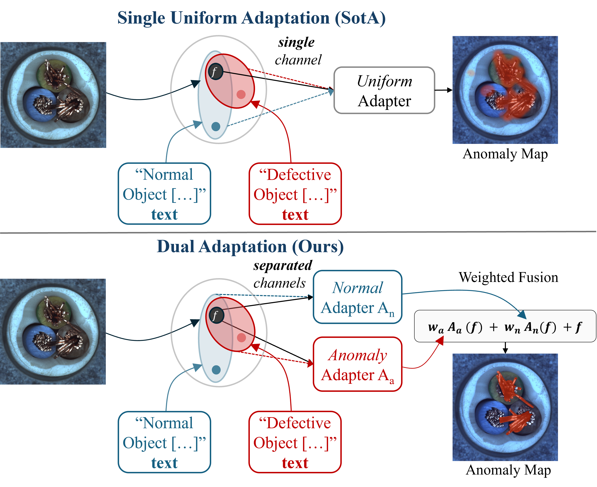

# AVA-DINO: Anomaly-Aware Vision-Language Adapters for Zero-Shot Anomaly Detection

**Accepted at IEEE ICIP 2026**

> Muhammad Aqeel\*, Maham Nazir\*, Uzair Khan, Marco Cristani, Francesco Setti  
> University of Verona, Italy | Beihang University, China  
> \*Equal Contribution

[[Paper](https://arxiv.org/abs/2605.12069)] [[GitHub](https://github.com/aqeelamirza/AVA-DINO)]

---

## Abstract

Zero-shot anomaly detection aims to identify defects in unseen categories without target-specific training. Existing methods apply the same feature transformation to all samples, treating normal and anomalous data uniformly despite their fundamentally asymmetric distributions — compact normals versus diverse anomalies. AVA-DINO exploits this natural asymmetry through dual specialized branches for normal and anomalous patterns that adapt frozen DINOv3 visual features. During training on auxiliary data, the two branches are learned jointly with a text-guided routing mechanism and explicit routing regularization that encourages branch specialization. At test time, only the input image and fixed predefined language descriptions are used to dynamically combine the two branches, enabling asymmetric activation without target-domain supervision.

---

## Method



AVA-DINO is composed of four modules:

1. **Encoding** — frozen DINOv3 ViT-L/16 extracts multi-scale patch tokens and CLS token from layers {6, 12, 18, 24}
2. **Anomaly-aware Dual Adaptation** — normal adapter An and anomaly adapter Aa learn context-specific transformations in parallel: `fn = An(f)`, `fa = Aa(f)`
3. **Text-Guided Dynamic Routing** — CLIP text embeddings for normal/anomaly states compute routing weights via temperature-scaled cosine similarity: `[wn, wa] = softmax([cos(fcls, tn_proj), cos(fcls, ta_proj)] / tau)`
4. **Weighted Fusion** — `fadapted = wn*fn + wa*fa + f` with residual connection preserving original DINOv3 representations

**Training objective:**

```
L = lambda1*Lseg + lambda2*Lglobal + lambda3*Lrouting

Lseg     = Lfocal(P, M) + Ldice(P, M)    # pixel-level supervision
Lglobal  = cross-entropy                   # image-level supervision
Lrouting = MSE(wn, 1-y) + MSE(wa, y)      # routing specialization
```

Loss weights: lambda1=0.5, lambda2=0.25, lambda3=0.1, routing temperature tau=0.1

---

## Results

| Domain | Dataset | I-AUC | P-AUC | Pixel-F1 |
|--------|---------|-------|-------|----------|
| Industrial | MVTec-AD | **93.5** | **92.1** | **50.6** |
| Industrial | ViSA | **87.2** | **95.9** | 29.2 |
| Industrial | BTAD | **91.8** | **92.2** | 27.9 |
| Industrial | KSDD2 | **96.2** | **99.3** | **72.6** |
| Industrial | MPDD | 70.1 | 94.1 | **34.3** |
| Industrial | MVTec-AD2 | **59.4** | **89.5** | **17.5** |
| Medical | Kvasir | — | **90.6** | **66.5** |
| Medical | CVC-ColonDB | — | **82.9** | **42.3** |
| Medical | CVC-ClinicDB | — | **90.7** | **57.2** |

*Training protocol: train on VisA, evaluate on all other datasets; for VisA evaluation, train on MVTec-AD.*  
*Medical datasets have no normal reference images; I-AUC is not reported.*

---

## Installation

```bash
conda create -n ava-dino python=3.10 -y
conda activate ava-dino
git clone https://github.com/aqeeelmirza/AVA-DINO.git
cd AVA-DINO
pip install -r requirements.txt
```

**Pre-trained backbones:**

- **DINOv3 ViT-L/16** — clone the [DINOv3 repository](https://github.com/facebookresearch/dinov2) to `./dinov3/` and place weights at `./dinov3_vitl16_pretrain_lvd1689m-8aa4cbdd.pth`
- **CLIP ViT-L/14-336** — downloaded automatically via OpenAI on first run

---

## Dataset Setup

Set the data roots via environment variables:

```bash
export AVA_DINO_INDUSTRIAL_ROOT=/path/to/industrial/datasets
export AVA_DINO_MEDICAL_ROOT=/path/to/medical/datasets
```

Or edit `INDUSTRIAL_ROOT` and `MEDICAL_ROOT` directly in `Datasets/__init__.py`.

| Dataset | Domain | Categories |
|---------|--------|-----------|
| MVTec-AD | Industrial | 15 |
| VisA | Industrial | 12 |
| BTAD | Industrial | 3 |
| MPDD | Industrial | 6 |
| MVTec-AD2 | Industrial | 8 |
| KSDD2 | Industrial | 1 |
| CVC-ClinicDB | Medical | 1 |
| CVC-ColonDB | Medical | 1 |
| Kvasir-SEG | Medical | 1 |
| Br35H | Medical | 1 |
| BrainMRI | Medical | 1 |
| HeadCT | Medical | 1 |
| ISIC | Medical | 1 |
| TN3K | Medical | 1 |

---

## Training

```bash
python train.py \
    --dataset     visa \
    --result_path ./results/visa \
    --epochs      20 \
    --batch_size  64 \
    --lr          1e-4 \
    --device      cuda:0
```

Checkpoints are saved to `<result_path>/ckpt/epoch_N.pth`.

---

## Evaluation

Single dataset:
```bash
python test.py \
    --dataset        mvtec \
    --checkpoint_dir ./results/visa/ckpt \
    --result_path    ./results_test/mvtec \
    --num_epochs     20 \
    --device         cuda:0
```

All datasets:
```bash
bash scripts/test_all.sh ./results/visa/ckpt
```

---

## Repository Structure

```
AVA-DINO/
├── train.py                  # Training entry point
├── test.py                   # Evaluation entry point
├── utils.py                  # CLIP prompt ensembling
├── CLIP/
│   ├── adapter.py            # AVADino dual-branch adapter (core architecture)
│   ├── clip.py               # CLIP model loader
│   ├── model.py              # CLIP ViT architecture
│   ├── model_configs/        # CLIP model configuration files
│   └── ...
├── Datasets/
│   ├── __init__.py           # Dataset registry
│   └── ...                   # Per-dataset loaders
├── tools/
│   ├── utils.py              # Feature extraction and forward pass
│   ├── loss.py               # Focal loss + Dice loss
│   └── visualization.py      # Result visualization
├── Figures/
│   └── Teaser.png
└── scripts/
    ├── train_mvtec.sh
    ├── test.sh
    └── test_all.sh
```

---

## Citation

```bibtex
@article{aqeel2026anomaly,
  title={Anomaly-Aware Vision-Language Adapters for Zero-Shot Anomaly Detection},
  author={Aqeel, Muhammad and Nazir, Maham and Khan, Uzair and Cristani, Marco and Setti, Francesco},
  journal={arXiv preprint arXiv:2605.12069},
  year={2026}
}
```

---

## License

This project is released under the MIT License.  
DINOv3 is subject to the [DINOv2 license](https://github.com/facebookresearch/dinov2/blob/main/LICENSE).  
CLIP is subject to the [OpenAI license](https://github.com/openai/CLIP/blob/main/LICENSE).
